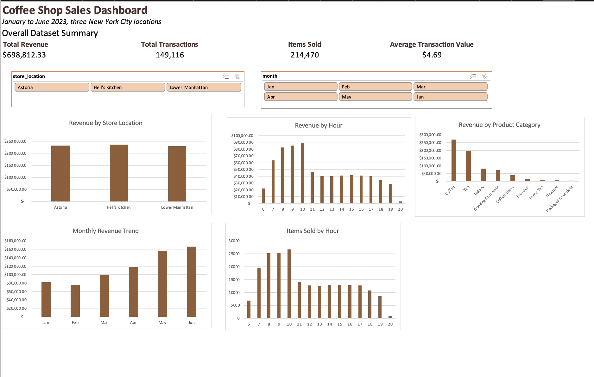

# Coffee Shop Sales Analysis

## Project Overview

This project analyzes transaction data for Maven Roasters, a fictional coffee shop with three locations in New York City. I used Excel and SQL to examine sales performance from January through June 2023 and created an interactive Excel dashboard with store and month filters.

## Dashboard

## Key Findings

* The business generated **$698,812.33** from **149,116 transactions** and sold **214,470 items**.
* The average transaction value was **$4.69**.
* Hell's Kitchen generated the most revenue, although revenue was similar across all three locations.
* Sales were strongest during the morning, with revenue peaking around **9–10 AM**.
* Monthly revenue generally increased from March through June, with June producing the highest revenue.
* Coffee was the highest-revenue product category, followed by Tea and Bakery.

## Tools Used

* **Excel:** data preparation, calculated columns, PivotTables, PivotCharts, slicers, and dashboard design
* **SQL with SQLite:** aggregation, filtering, grouping, common table expressions, and window functions
* **Google Colab:** running SQLite queries and documenting the SQL analysis

## Analysis Process

1. Converted the transaction data into an Excel table.
2. Created calculated columns for revenue, hour, weekday, and month.
3. Built PivotTables to analyze revenue by store, hour, month, and product category.
4. Created an interactive Excel dashboard with store and month slicers.
5. Loaded the prepared data into SQLite through Google Colab.
6. Wrote SQL queries to analyze overall performance, store performance, monthly trends, hourly patterns, product categories, weekdays, and peak hours by location.

## Project Files

* [Excel analysis and dashboard](coffee_shop_sales_analysis.xlsx)
* [SQL analysis](coffee_shop_sales_analysis.sql)
* [Google Colab notebook](coffee_shop_sales_sql.ipynb)
* [Dashboard image](coffee_shop_sales_dashboard.png)

## Data Source

The dataset is the [Coffee Shop Sales dataset from Maven Analytics](https://mavenanalytics.io/data-playground/coffee-shop-sales). It contains transaction-level records for three New York City coffee shop locations and is provided under a public-domain license.
